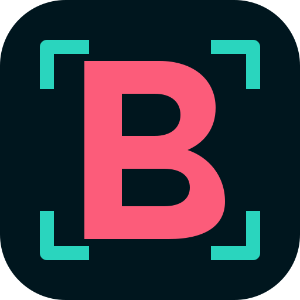

# Marca Brandfy

A Brandfy transforma estratégia de marca em artefatos reproduzíveis por
pessoas e agentes. Sua identidade combina o petróleo e o turquesa da
Promovaweb com coral rosado, uma variação que representa expressão e criação.

## Conceito visual

O símbolo é um **B modular dentro de uma moldura de enquadramento**. Os dois
blocos curvos pertencem à mesma marca, enquanto os quatro cantos representam
o sistema que delimita, organiza e valida aplicações. A placa petróleo, a
construção central simples e os cantos arredondados aproximam o Brandfy da
família visual formada por Specsfy e SetupVibe. O coral preserva a expressão
própria do Brandfy, e o turquesa mantém o parentesco institucional.

## Paleta essencial

| Papel | Light mode | Dark mode |
| --- | --- | --- |
| Fundo | `#F2F8F9` | `#000A0E` |
| Superfície | `#FFFFFF` | `#001117` |
| Texto | `#00161E` | `#ECFDFB` |
| Texto secundário | `#2D4C58` | `#B2C6CE` |
| Acento | `#9F1E41` | `#FDA4B7` |
| Foco | `#15626A` | `#5EEDE1` |

Petróleo e turquesa formam a base institucional. Coral rosado identifica
criação, curadoria e escolhas próprias da Brandfy.

## Arquivos oficiais

| Arquivo | Uso |
| --- | --- |
| `brand/logo/svg/icon.svg` | ícone principal com placa petróleo |
| `brand/logo/svg/icon-light.svg` | ícone transparente sobre fundo claro |
| `brand/logo/svg/icon-dark.svg` | ícone transparente sobre fundo escuro |
| `brand/logo/svg/logo-light.svg` | assinatura horizontal sobre fundo claro |
| `brand/logo/svg/logo-dark.svg` | assinatura horizontal sobre fundo escuro |
| `brand/logo/icon.png` | fallback raster de 512 × 512 px |

Use `icon-light.svg` no tema claro e `icon-dark.svg` no tema escuro. Preserve
proporção, cores e área livre mínima equivalente a 12,5% da largura do ícone.
O tamanho mínimo é 24 px para o ícone e 120 px para a assinatura horizontal.
Os arquivos SVG diretamente em `brand/logo/` são atalhos de compatibilidade. As
exportações auditáveis ficam em `brand/logo/svg/`, `brand/logo/png/` e
`brand/manifest.json`.

## Sistema digital

- `brand/colors/palette.json`: fonte editável da paleta;
- `brand/tokens.json`: tokens agnósticos;
- `brand/global.css`: webfontes, variáveis CSS e troca automática de tema;
- `brand/tailwind-theme.js`: extensão de tema para Tailwind CSS;
- `brand/accessibility.md`: relatório de contraste;
- `brand/typography/README.md`: hierarquia e regras tipográficas;
- `brand/templates/`: fontes SVG e exemplos exportados para canais.

Para CSS, importe apenas `brand/global.css`. Para Tailwind, espalhe o objeto
exportado por `brand/tailwind-theme.js` em `theme.extend`.

## Templates de canais

O diretório `brand/templates/` contém:

- capa e página interna de carrossel para Instagram;
- arte quadrada para post no LinkedIn;
- cabeçalho horizontal para email;
- thumbnail e banner de canal para YouTube;
- exemplos preenchidos em SVG e PNG.

As zonas seguras, os limites de texto e o fluxo para agentes estão em
`brand/templates/README.md`.

## Estratégia e voz

Missão, visão, valores, posicionamento e promessa estão em
`brand/strategy.md`. A voz, os tons, o vocabulário e os exemplos estão em
`brand/voice.md`.

## Tipografia e acessibilidade

O guia de tipografia está em `brand/typography/README.md`. O relatório de
acessibilidade e os contrastes calculados estão em `brand/accessibility.md`.

## Governança

Toda alteração em paleta deve partir de `brand/colors/palette.json` e
recompilar os tokens. Toda alteração de logo deve atualizar os SVGs, PNGs,
templates e `brand/manifest.json`. Depois, recompile `brand/brand-guide.pdf` e
execute a auditoria.

O PDF usa o design system global em `brand/pdf/`. O kit contém CSS, template,
Inter, Manrope e licenças, e é o mesmo que a skill copia para o projeto
consumidor. Personalize metadados e logo; preserve A4, capa clara, hierarquia,
sumário, tabelas, código e paginação.

Este `brand/brand-guide.pdf` documenta a identidade do próprio Brandfy e
demonstra a saída criada pela skill em um projeto consumidor. O guia de uso do
produto é outro artefato, compilado de `docs/user/` e publicado em `ebooks/`.

## Regras para agentes

1. Use somente os arquivos desta pasta como fonte de marca.
2. Escolha a variante do logo pelo fundo, nunca com filtros CSS.
3. Use tokens semânticos; não copie valores hexadecimais para componentes.
4. Coral indica criação ou destaque. Turquesa mantém o parentesco institucional.
5. Não aplique gradiente, sombra, rotação, distorção ou novo contorno ao logo.
6. Toda nova aplicação deve preservar contraste WCAG AA e ser registrada no
   `BRAND.md`.
